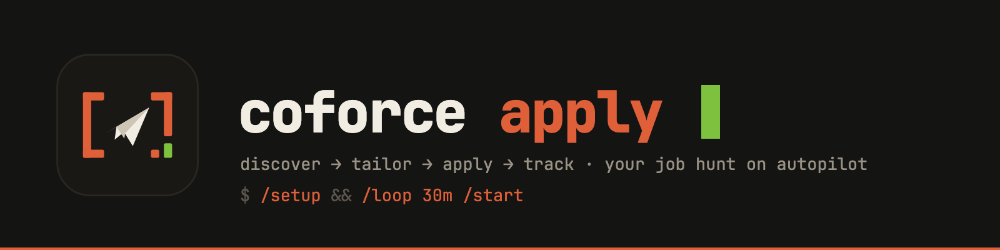

<p align="center">
  
</p>

# CoForce Apply

**Your job hunt on autopilot.** CoForce Apply is a skill-first job application
agent: Claude Code discovers postings, tailors your resume, submits
applications, and tracks everything on a local kanban — while a slim Chrome
extension handles the in-browser last mile. All of your data stays on your
machine.

```
sources (GitHub job lists)          profile/ (local, gitignored)
        │                            profile.json      your background
   scripts/hunt.mjs ──dedup──▶       applications.json tracker truth
        │                            instructions.md   your standing rules
        ▼                            applications/<id>/ per-app archive
  new postings ──▶ tailor ──▶ apply ──▶ board (kanban, drag & drop)
                     │           │
                LaTeX/PDF/docx   tier 1: extension form-fill
                                 tier 2: Claude browser-use fallback
```

## Quick start

```sh
git clone https://github.com/Sma1lboy/jd-resume-fitter.git && cd jd-resume-fitter
yarn install
claude   # then:
```

1. **`/setup`** — one-time onboarding: import or interview your background,
   set your email + consents, name the companies you never want to apply to,
   confirm job sources (seeded with
   [2027-SWE-College-Jobs](https://github.com/speedyapply/2027-SWE-College-Jobs)
   and [Summer2027-Internships](https://github.com/vanshb03/Summer2027-Internships)).
2. **`/start`** — one cycle: fetch sources → skip anything already applied or
   blocklisted → auto-apply (capped, with confirmation) → refresh the board.
3. **`/loop 30m /start`** — keep it running every half hour.

## What's inside

| Skill | What it does |
|---|---|
| `setup` | One-time onboarding: profile, consents, standing instructions, job sources |
| `start` | One discover→apply cycle; recurring via `/loop 30m /start` |
| `profile` | Maintain your background (`profile/profile.json`) |
| `repo-bullets` | Turn a git repo's real commits into STAR resume bullets |
| `tailor` | JD → tailored one-page resume (LaTeX/PDF/docx, template or reference-guided) |
| `apply` | Browser-use application: fills forms, registers ATS accounts (Workday & co., passwords in macOS Keychain), stops before submit for your confirmation |
| `tracker` | Application tracker + kanban board + per-application file archive |
| `harness` | Mock-environment E2E test of the whole pipeline |

**The board** (`yarn board:serve` → http://localhost:4517) is a
kobe-Hallmark-themed kanban over `profile/applications.json`: five pipeline
columns (To Apply → Applied → Interviewing → Offer / Rejected), drag & drop
persists status changes, cards open a detail view with the JD link, saved
info, delivery history timeline, archived files, and job description.

**Your instructions rule everything.** `profile/instructions.md` is standing
user instruction — preferences, caps, and a `## never-apply` company list that
every skill and script respects. Duplicate applications are hard-blocked by
URL and company+role matching.

**Two-tier delivery.** The extension's Apply tab form-fills from your profile
(tier 1); when a form resists, one click hands the job to Claude browser-use
(tier 2, the `apply` skill) — which can also register ATS accounts with
locally-generated Keychain-stored passwords and fetch email verification
codes, all gated on consents you grant once during setup.

## Extension (developer mode)

```sh
yarn build:chrome
```

Load `extension/chrome` via `chrome://extensions` → Developer mode → Load
unpacked. Options → Profile → "Import from JSON" accepts
`profile/profile.json` as-is; the Apply tab syncs with the tracker via
Export/Import JSON.

## Development

- `yarn dev:chrome` / `yarn build:chrome` — extension watch / production build
- `yarn harness` — deterministic checks: two-tier apply, resume formats, board, hunt
- `yarn board` / `yarn board:serve` — static / live kanban
- `yarn hunt` — one discovery pass (`--track` to record)
- `yarn lint` — ESLint

Key paths: `.claude/skills/` (the skills), `scripts/` (board + hunt),
`harness/` (mock E2E), `src/` (extension). Full design history in
[docs/ROADMAP.md](docs/ROADMAP.md); the CoForce merge plan in
[docs/MIGRATION.md](docs/MIGRATION.md).

## Privacy

Everything personal lives in `profile/` (gitignored) and
`browser.storage.local` — nothing leaves your machine except the applications
you approve. ATS passwords go to macOS Keychain, never to files. See
[PRIVACY.md](PRIVACY.md).

## License

MIT — see [LICENCE](LICENCE).
