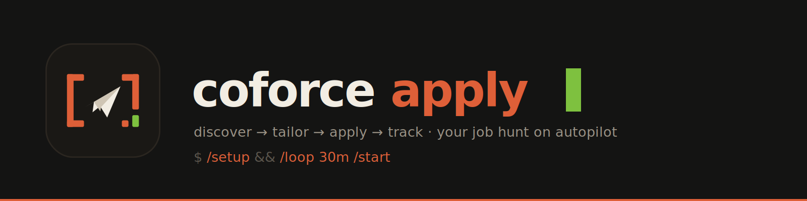
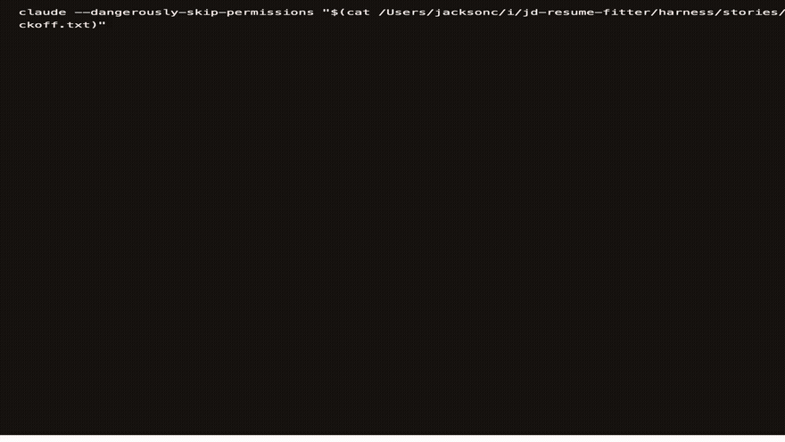

<p align="center">
  
</p>

# CoForce Apply

**Your job hunt on autopilot.** CoForce Apply is a skill-first job application
agent: Codex or Claude Code discovers postings, matches them against your real
GitHub work, builds reviewable resumes, submits approved applications, and
tracks everything locally — while a slim Chrome
extension handles the in-browser last mile. All of your data stays on your
machine.

<p align="center">
  
  <br><em>A real <code>/setup</code> session end to end (7× speed).</em>
</p>

```
sources (GitHub job lists)          ~/.coforce/ (your data, local only)
        │                            profile.json       your background
   hunt.mjs ──dedup──▶               applications.json  tracker truth
        │                            instructions.md    your standing rules
        ▼                            experience/       sources.json (repo + authors)
                                     └─ compact Tier 0 tagged index
  new postings ──▶ full JD ──▶ Tier 0 match ──▶ LaTeX/PDF ──▶ Review
                                                                   │ approved
                                                                   ▼
                     ZIP export ◀── job folders            apply ──▶ board
                                                             tier 1: form-fill
                                                             tier 2: Chrome agent
```

## Use from a clone

Clone the repository, enter the checkout, and start either agent there:

```sh
git clone https://github.com/Sma1lboy/coforce-apply
cd coforce-apply
codex   # or: claude
```

Codex discovers `.agents/skills` directly. `.claude/skills` is a compatibility
symlink to the same canonical tree, so Claude Code sees identical skills
without a second copy or any global installation. Enable the appropriate
Chrome integration before using the `apply` flow.

### Best practice: a private fork as your career data repo

Clone works, but a **private fork** is better: your profile, tracker, standing
instructions, and per-application archives live inside the checkout at
`.coforce/` and sync across machines through your fork — supplement your
profile on the laptop, apply from the desktop, everything follows.

```sh
gh repo fork Sma1lboy/coforce-apply --clone --fork-name my-coforce
cd my-coforce
gh repo edit --visibility private --accept-visibility-change-consequences
codex   # or: claude — then run $setup and pick "private-fork sync"
```

Setup refuses to create an in-repo data home until it verifies the fork is
actually private. Every skill resolves the data home the same way:
`$COFORCE_HOME` env override → `<checkout>/.coforce/` if present →
`~/.coforce`. Sync is your normal git flow (`git pull` / `git push` on the
fork; `git pull upstream main` to update the tool); generated `out/`
artifacts never sync, and ATS passwords stay in the local Keychain — never in
files.

Skills carry their own scripts (`tracker/scripts/board.mjs`,
`experience/scripts/experience.mjs`, `start/scripts/hunt.mjs`,
`campaign/scripts/campaign.mjs`) — core operation needs Node ≥ 22 and Python 3.
The explicit Tier 0 refresh uses authenticated `gh`; every JD campaign reads
the resulting local index without rescanning GitHub. PDF
rendering needs `latexmk`, `pdflatex`, or `tectonic`. All personal data lives in
`~/.coforce/`.

## Use

1. **`$setup`** — one-time onboarding: import or interview your background,
   provide your LaTeX template, set email/consents, name the
   companies you never want to apply to,
   confirm job sources (seeded with
   [2027-SWE-College-Jobs](https://github.com/speedyapply/2027-SWE-College-Jobs)
   and [Summer2027-Internships](https://github.com/vanshb03/Summer2027-Internships)).
2. **`$experience https://github.com/owner/repo`** — paste a repository, PR, or
   commit URL. The agent infers the repository and author, then maintains the
   compact source list internally; you only correct it if the inference is wrong.
3. **`$experience refresh`** — build Tier 0 from only that allowlist: fetch the
   declared authors' history, combine it with your curated profile, and persist
   a compact source-backed experience index.
   Run `$experience build` after profile-only edits; it does not access GitHub.
4. **`$start`** — one cycle: fetch sources → hydrate full JDs → match the local
   Tier 0 index → render PDFs → open the Review workspace. Existing
   approved jobs are left alone; saved feedback is applied on the next cycle.
5. Use a Codex scheduled task when you want `$start` to run repeatedly.
6. By default, review each job/PDF, request changes or approve it, then export
   every approved job folder as one ZIP. Turn off **Require resume review** in
   Settings to auto-approve complete one-page PDFs and auto-refresh the ZIP.
   Run `$apply <url>` later when you actually want to submit; final submit still
   requires explicit confirmation in either mode.

Type the `$...` invocations inside an interactive Codex session. `$apply`
selects the Chrome integration internally, so `codex '$apply <url>'` is the
complete command and operates the same visible, logged-in Chrome you already
use. Claude Code uses the equivalent slash commands (`/setup`, `/start`,
`/apply`, and so on) with its `--chrome` integration.

## What's inside

| Skill | What it does |
|---|---|
| `setup` | One-time onboarding: profile, consents, standing instructions, job sources |
| `experience` | Tier 0: ingest GitHub URLs, infer repo/author scope, explicitly refresh evidence, and rebuild compact profile tags offline |
| `start` | One discover→resume-review cycle; recurring through the host agent's scheduler |
| `campaign` | Full JD + local Tier 0 matching + LaTeX/PDF review, feedback, approval, and multi-job ZIP export |
| `profile` | Maintain your background (`~/.coforce/profile.json`) |
| `repo-bullets` | Turn a git repo's real commits into STAR resume bullets |
| `tailor` | JD → tailored one-page resume (LaTeX/PDF/docx, template or reference-guided) |
| `apply` | Chrome-backed application: fills forms, registers ATS accounts (Workday & co., passwords in macOS Keychain), stops before submit for your confirmation |
| `tracker` | Application tracker + kanban board + per-application file archive |
| `harness` | Mock-environment E2E test of the whole pipeline (repo-dev only) |
| `shushu-internship-tool` | *Third-party sample* ([upstream](https://github.com/LiuMengxuan04/shushu-internship-tool), Apache-2.0): JD → find/adapt a real GitHub project → STAR resume lines + interview pack, wired into the CoForce profile/tracker. Review: [docs/third-party/shushu-judge.md](docs/third-party/shushu-judge.md) |

**The console** (http://localhost:4517, served by the tracker skill) is a
kobe-Hallmark-themed local workspace over `~/.coforce/`: five application pipeline
columns (To Apply → Applied → Interviewing → Offer / Rejected), drag & drop
persists status changes, cards open a detail view with the JD link, saved
info, delivery history timeline, archived files, and job description. The
**Discover** lists fresh postings from your sources (speedyapply, vanshb03,
jobright-ai out of the box) with one-click **Build resume**. **Review** pairs the
job link and evidence shortlist with a zoomable PDF proof, feedback, approval,
and an all-approved ZIP export. **Profile**, **Instructions**, and **Settings**
edit local data and runtime/template configuration without raw JSON.

**Your instructions rule everything.** `~/.coforce/instructions.md` is standing
user instruction — preferences, caps, and a `## never-apply` company list that
every skill and script respects. Duplicate applications are hard-blocked by
URL and company+role matching.

**Two-tier delivery.** The extension's Apply tab form-fills from your profile
(tier 1); when a form resists, one click hands the job to the configured agent
(tier 2, the `apply` skill) in your existing visible Chrome session — which can
also register ATS accounts with
locally-generated Keychain-stored passwords and fetch email verification
codes, all gated on consents you grant once during setup.

## Extension (optional, developer mode)

The tier-1 form-filler is a Chrome extension; building it is the one thing
that needs the repo:

```sh
git clone https://github.com/Sma1lboy/coforce-apply && cd coforce-apply
yarn install && yarn build:chrome
```

Load `extension/chrome` via `chrome://extensions` → Developer mode → Load
unpacked. Options → Profile → "Import from JSON" accepts
`~/.coforce/profile.json` as-is; the Apply tab syncs with the tracker via
Export/Import JSON.

## skill-story — test a skill's conversation like code

Skills are described by features, but their real product surface is an
interaction flow (setup interviews, adversarial reviewers, confirm-gated
pipelines) — and prompts are black boxes until you watch one run. The
bundled **skill-story** meta-skill turns any skill's flow into a visible,
repeatable test: write the expected conversation script, run a REAL agent
session in a sandbox, capture every frame with true colors, verify the
outcome, sediment findings back into the skill's prompts.

The animated demo at the top of this README is a skill-story artifact: a real
`/setup` run recorded via `npm run story:record` and re-rendered via
`npm run story:render` (capture once, render many).
Standalone repo: [Sma1lboy/skill-story](https://github.com/Sma1lboy/skill-story).

## Development (this repo)

- `yarn dev:chrome` / `yarn build:chrome` — extension watch / production build
- `yarn harness` — deterministic checks: evidence, campaign ZIP, two-tier apply, board, hunt
- `yarn board` / `yarn board:serve` — static / live kanban
- `yarn hunt` — one discovery pass (`--track` to record)
- `yarn lint` — ESLint

Key paths: `.agents/skills/` (the canonical distributable skills + scripts),
`harness/` (mock E2E), `src/` (extension). Full design history in
[docs/ROADMAP.md](docs/ROADMAP.md); the CoForce merge plan in
[docs/MIGRATION.md](docs/MIGRATION.md).

## Privacy

Everything personal lives in `~/.coforce/` and `browser.storage.local` —
nothing leaves your machine except the applications you approve. ATS passwords go to macOS Keychain, never to files. See
[PRIVACY.md](PRIVACY.md).

## License

MIT — see [LICENCE](LICENCE).
