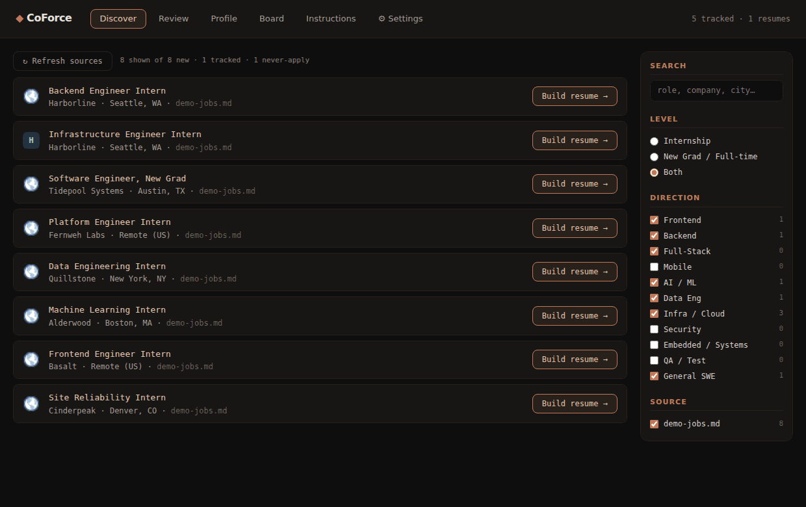
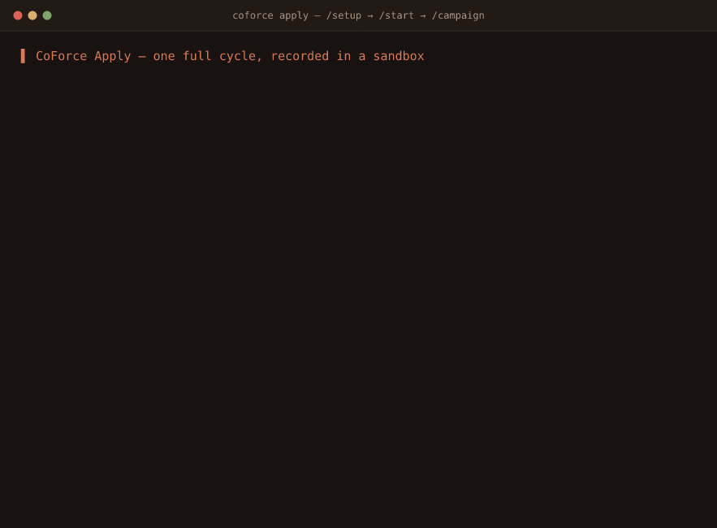
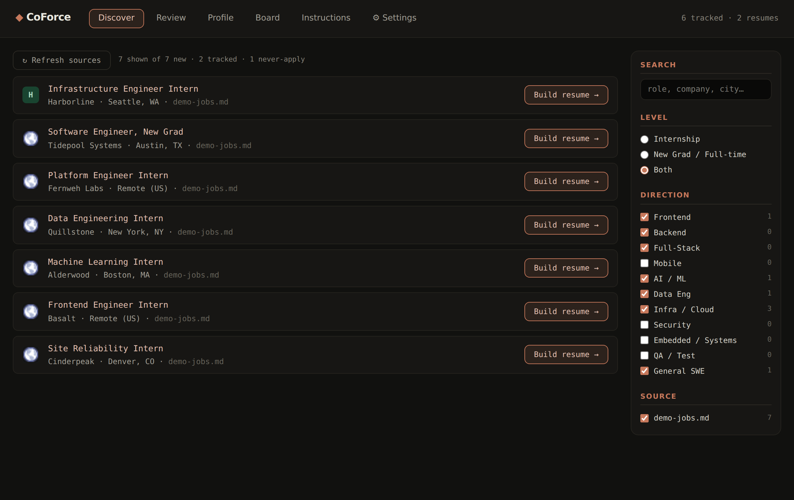

<p align="center">
  
</p>

# CoForce Apply

**Your job hunt on autopilot.** CoForce Apply is a skill-first job application
agent: Claude Code discovers postings, matches them against your real GitHub
work, builds reviewable resumes, fills and submits approved applications in
your own Chrome, and tracks everything locally. All of your data stays on your
machine.

<p align="center">
  
  <br><em>The local console at <code>localhost:4517</code> — discover, review the
  rendered PDF against the evidence behind it, track, and keep your record.
  Recorded by driving the real console in a browser
  (<code>npm run record:console</code>), not mocked up.</em>
</p>

```
sources (GitHub job lists)          ~/.coforce/ (your data, local only)
        │                            profile.json       your background
   hunt.mjs ──dedup──▶               applications.json  tracker truth
        │                            instructions.md    your standing rules
        ▼                            experience/       sources.json (repo + authors)
                                     └─ compact Tier 0 tagged index
  new postings ──▶ full JD ──▶ Tier 0 match ──▶ LaTeX/PDF ──▶ Review
                                                                   │ approved
                                                                   ▼
                     ZIP export ◀── job folders            apply ──▶ board
                                                          (your visible Chrome,
                                                       stops before submit)
```

## Requirements

| What | Needed for |
|---|---|
| **Claude Code** | everything — it is the runtime the skills run in |
| **Node ≥ 22** | every script (the repo has no npm dependencies) |
| **A LaTeX engine** — `latexmk`, `pdflatex`, or `tectonic` | rendering any resume |
| **poppler-utils** (`pdfinfo`, `pdftotext`) | the one-page / page-coverage / ATS-extractability checks — a resume cannot be approved without them |
| **`gh`, authenticated** | `/experience` and the private-fork setup path |
| **Python 3** | `/experience refresh` only |
| **Chrome + Claude in Chrome** | `/apply` only |

macOS and Linux are supported. Windows needs WSL2. ATS account passwords are
stored in the macOS Keychain, so that one feature is macOS-only.
Per-platform install commands are in **[docs/INSTALL.md](docs/INSTALL.md)**.

## Install

```sh
git clone https://github.com/Sma1lboy/coforce-apply
cd coforce-apply
claude
```

The canonical skill tree is `.agents/skills`; `.claude/skills` is a symlink to
it, so Claude Code sees the skills with no global installation and no second
copy.

Two other install modes — a **private fork** as your career data repo (your
profile and tracker sync across machines inside the checkout), and a
**skills-only** copy with no checkout at all — are in
[docs/INSTALL.md](docs/INSTALL.md), along with verification, updating, and
uninstall.

## Try it in two minutes

Before onboarding anything: give it one job posting and your current resume,
get a tailored PDF back.

```
/tailor https://job-posting-url        # then paste or point at your resume
```

That is the whole product in one command — a JD in, a one-page PDF out, every
line lifted verbatim from what you wrote. Everything below is what you add when
you want it to run *repeatedly*: discovery, batching, tracking, and submission.

## Use

1. **`/setup`** — one-time onboarding: import or interview your background,
   install the LaTeX template, set intent and consents, and name the companies
   you never want to apply to. Job sources are seeded with
   [2027-SWE-College-Jobs](https://github.com/speedyapply/2027-SWE-College-Jobs),
   [Summer2027-Internships](https://github.com/vanshb03/Summer2027-Internships),
   and [jobright-ai](https://github.com/jobright-ai/2026-Software-Engineer-Internship).
2. **`/experience https://github.com/owner/repo`** — paste a repository, PR, or
   commit URL. The agent infers the repo and the author, and asks only if the
   inference looks wrong. It also drafts STAR bullets from real commits for you
   to review into your profile.
3. **`/experience refresh`** — fetch just those authors' history and build the
   Tier 0 index. (`/experience build` rebuilds it offline after profile edits.)
4. **`/start`** — one cycle: sources → full JDs → Tier 0 match → PDFs → the
   Review workspace. Approved jobs are left alone; saved feedback is applied on
   the next cycle.
5. **`/loop 30m /start`** — that cycle, repeatedly.
6. **Review, approve, export.** Review each PDF in the console and approve it,
   then export every approved job as one ZIP. Turning off *Require resume
   review* in Settings auto-approves complete one-page PDFs instead.
7. **`/apply <url>`** — when you actually want to submit. It drives your own
   visible Chrome and stops before the final submit for your confirmation, in
   every mode.

Full walkthrough, command reference, troubleshooting and FAQ:
**[docs/USAGE.md](docs/USAGE.md)**.

## What's inside

| Skill | What it does |
|---|---|
| `coforce` | Entry point & router: matches vague intent ("我想找工作", "what next") to the right skill, or routes by pipeline state |
| `setup` | One-time onboarding: profile, consents, standing instructions, job sources |
| `experience` | Module 1: ingest GitHub URLs, refresh the Tier 0 evidence index, and turn a repo's real commits into JD-free STAR bullets for you to review into the profile |
| `start` | One discover→resume-review cycle; recurring through the host agent's scheduler |
| `campaign` | Full JD + local Tier 0 matching + LaTeX/PDF review, feedback, approval, and multi-job ZIP export |
| `profile` | Maintain your background (`~/.coforce/profile.json`) |
| `tailor` | JD → tailored one-page resume (LaTeX/PDF/docx, template or reference-guided) |
| `apply` | Chrome-backed application: fills forms, registers ATS accounts (Workday & co., passwords in macOS Keychain), stops before submit for your confirmation |
| `tracker` | Application tracker + kanban board + per-application file archive |
| `interview` | Stage-specific interview prep from the archived JD, the actually-submitted resume, and prior-stage feedback; optional mock interview |
| `harness` | Mock-environment E2E test of the whole pipeline (repo-dev only) |

## Two modules, one rule

Module 1 (**supply**) turns your real work into bullets with no job description
in sight, and you review them into `profile.json` — that file *is* the verified
pool. Module 2 (**demand**) reads one JD and strictly **selects** from that pool,
verbatim; an id that is not in the pool is rejected before anything renders. New
wording always goes back through Module 1's review gate.

That is why the tool cannot invent experience to fit a posting, and it is the
one design rule everything else follows.

<p align="center">
  
  <br><em>The same cycle underneath, where the rule is visible: a bullet id that
  is not in the pool is rejected outright. Recorded against the real scripts in
  a sandbox by <code>npm run record:setup</code>, which asserts the state after
  every step — so this demo cannot drift from the code.</em>
</p>

## The console

`http://localhost:4517`, served by the tracker skill — a local workspace over
`~/.coforce/`, in your system's light or dark theme.

<p align="center">
  
</p>

**Discover** lists fresh postings from your sources with one-click *Build
resume*. **Review** pairs the job and its evidence shortlist with a zoomable PDF
proof, the internal QA gates, feedback, approval, and the all-approved ZIP
export. **Board** is five drag-and-drop columns with per-application archives and
delivery history. **Profile** edits your record and the resume skill policy
(baseline skills and role packs). **Instructions** and **Settings** edit your
standing instructions and runtime configuration without touching raw JSON.

A tour with screenshots is in [docs/USAGE.md](docs/USAGE.md#the-console).

**Your instructions rule everything.** `~/.coforce/instructions.md` is standing
user instruction — preferences, caps, and a `## never-apply` company list that
every skill and script respects. Duplicate applications are hard-blocked by URL
and company+role matching.

**Delivery.** The `apply` skill drives your existing visible Chrome session —
filling forms, registering ATS accounts with locally-generated Keychain-stored
passwords, and fetching email verification codes, all gated on consents you
grant once during setup. It always stops before the final submit; the
confirmation is yours. (A scripted form-filler Chrome extension used to sit in
front of it as a free "tier 1"; it was deleted — the agent handles the same
pages, and the second implementation cost more to maintain than the LLM calls it
saved. See [docs/OPERATOR.md](docs/OPERATOR.md) for the contract a cheaper
operator would have to satisfy to slot back in.)

## Documentation

| Doc | What is in it |
|---|---|
| [docs/INSTALL.md](docs/INSTALL.md) | Prerequisites per platform, the three install modes, verifying, updating, uninstalling |
| [docs/USAGE.md](docs/USAGE.md) | Vocabulary, a worked end-to-end run, command reference, console tour, troubleshooting, FAQ |
| [docs/DATA.md](docs/DATA.md) | Every file in `~/.coforce/`, who owns it, and what is safe to delete |
| [docs/ARCHITECTURE.md](docs/ARCHITECTURE.md) | Design invariants and flow (living mermaid doc) |
| [docs/OPERATOR.md](docs/OPERATOR.md) | The submission-operator contract: inputs, status events, confirmation-gate iron laws |
| [PRIVACY.md](PRIVACY.md) | What leaves your machine (the applications you approve, and nothing else) |

## Development (this repo)

- `npm run harness` — deterministic checks: evidence, campaign ZIP, apply
  lifecycle, board, hunt. No network, no LLM calls, stubbed agent CLI.
- `npm run board` — the console (API + prebuilt React app) on :4517
- `npm run hunt` — one discovery pass (`--track` to record)
- `npm run sandbox` — a seeded throwaway data home + the real console on :4519
- `npm run record:console` — re-record the README hero: seeds a throwaway data
  home, starts the real console on it, drives the real UI in a browser, and
  writes both the GIF and the 2x stills the docs embed. Needs
  `npm i --no-save playwright pngjs gifenc && npx playwright install chromium`.
- `npm run record:setup` — re-record the terminal demo: the driver runs the real
  pipeline in a sandbox and asserts the state after every step, so a stale claim
  fails the recording instead of shipping.
- `npm run record:demo` — re-render `docs/assets/demo.gif` and `demo.svg` from
  the last capture. The animated SVG needs nothing; the GIF needs two dev-only
  packages that are deliberately absent from `package.json`:
  `npm i --no-save @resvg/resvg-js gifenc`.
- `npm run record:session` — drive a REAL agent session through a skill in a
  throwaway sandbox and capture the whole interaction script (every question,
  tool call and reply). A skill's real product surface is its conversation, and
  prompts are black boxes until you watch one run; this is what you tune
  `SKILL.md` against. For re-rendering those captured conversations as a video,
  see [Sma1lboy/skill-story](https://github.com/Sma1lboy/skill-story).

The repo has no npm dependencies: every script runs on Node builtins, and the
console (`.agents/skills/tracker/web/`) ships its prebuilt `dist/`, so a clone
needs no install to run either one.

Key paths: `.agents/skills/` (the canonical distributable skills + scripts),
`harness/` (mock E2E). Architecture & flow (mermaid, living doc) in
[docs/ARCHITECTURE.md](docs/ARCHITECTURE.md); the CoForce merge plan in
[docs/MIGRATION.md](docs/MIGRATION.md).

## Privacy

Everything personal lives in `~/.coforce/` — nothing leaves your machine except
the applications you approve. ATS passwords go to the macOS Keychain, never to
files. See [PRIVACY.md](PRIVACY.md) and [docs/DATA.md](docs/DATA.md).

## License

MIT — see [LICENCE](LICENCE).
