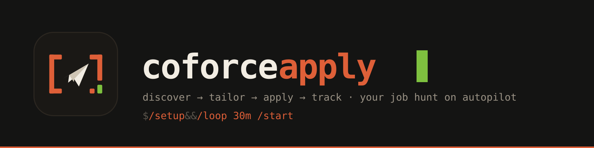
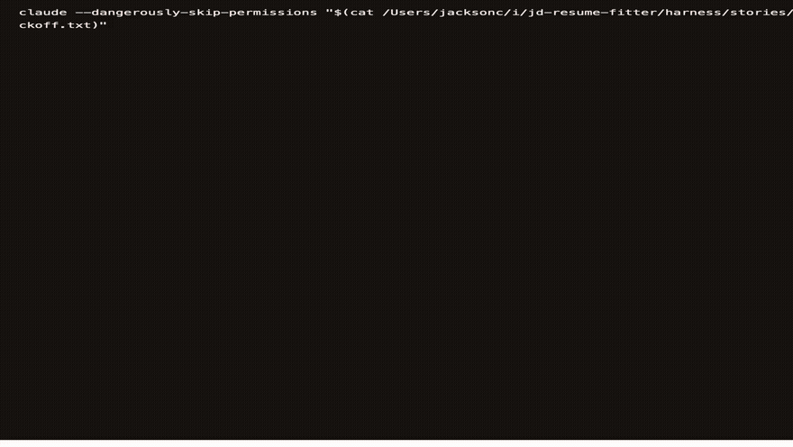

<p align="center">
  
</p>

# CoForce Apply

**Your job hunt on autopilot.** CoForce Apply is a skill-first job application
agent: Claude Code discovers postings, matches them against your real GitHub
work, builds reviewable resumes, fills and submits approved applications in
your own Chrome, and tracks everything locally. All of your data stays on your
machine.

<p align="center">
  
  <br><em>A real <code>/setup</code> session end to end (7× speed).</em>
</p>

```
sources (GitHub job lists)          ~/.coforce/ (your data, local only)
        │                            profile.json       your background
   hunt.mjs ──dedup──▶               applications.json  tracker truth
        │                            instructions.md    your standing rules
        ▼                            experience/       sources.json (repo + authors)
                                     └─ compact Tier 0 tagged index
  new postings ──▶ full JD ──▶ Tier 0 match ──▶ LaTeX/PDF ──▶ Review
                                                                   │ approved
                                                                   ▼
                     ZIP export ◀── job folders            apply ──▶ board
                                                          (your visible Chrome,
                                                       stops before submit)
```

## Use from a clone

Clone the repository, enter the checkout, and start Claude Code there:

```sh
git clone https://github.com/Sma1lboy/coforce-apply
cd coforce-apply
claude
```

The canonical skill tree is `.agents/skills`; `.claude/skills` is a symlink to
it, so Claude Code sees the skills without a second copy or any global
installation. Enable Claude in Chrome before using the `apply` flow.

### Best practice: a private fork as your career data repo

Clone works, but a **private fork** is better: your profile, tracker, standing
instructions, and per-application archives live inside the checkout at
`.coforce/` and sync across machines through your fork — supplement your
profile on the laptop, apply from the desktop, everything follows.

```sh
gh repo fork Sma1lboy/coforce-apply --clone --fork-name my-coforce
cd my-coforce
gh repo edit --visibility private --accept-visibility-change-consequences
claude   # then run /setup and pick "private-fork sync"
```

Setup refuses to create an in-repo data home until it verifies the fork is
actually private. Every skill resolves the data home the same way:
`$COFORCE_HOME` env override → `<checkout>/.coforce/` if present →
`~/.coforce`. Sync is your normal git flow (`git pull` / `git push` on the
fork; `git pull upstream main` to update the tool); generated `out/`
artifacts never sync, and ATS passwords stay in the local Keychain — never in
files.

### Or: install just the skills (no checkout)

The other supported entry is copying the skill tree into your agent's own
skills directory — no repo checkout at runtime:

```sh
git clone --depth 1 https://github.com/Sma1lboy/coforce-apply
cp -R coforce-apply/.agents/skills/* ~/.claude/skills/   # Claude Code
cp -R coforce-apply/.agents/lib     ~/.claude/lib        # shared script utils
```

The layout rule is the only requirement: the skill directories and a sibling
`lib/` one level above them (scripts import `../../../lib/…`), so the same
recipe works for any agent runtime with a global skills directory. In this
mode the data home resolves to `~/.coforce` (or `$COFORCE_HOME`); the
`coforce` router skill ships with the set, so intent navigation works without
the repo's CLAUDE.md; skip `harness` (repo-dev-only).

Skills carry their own scripts (`tracker/scripts/board.mjs`,
`experience/scripts/experience.mjs`, `start/scripts/hunt.mjs`,
`campaign/scripts/campaign.mjs`) — core operation needs Node ≥ 22 and Python 3.
The explicit Tier 0 refresh uses authenticated `gh`; every JD campaign reads
the resulting local index without rescanning GitHub. PDF
rendering needs `latexmk`, `pdflatex`, or `tectonic`. All personal data lives in
`~/.coforce/`.

## Use

1. **`/setup`** — one-time onboarding: import or interview your background,
   provide your LaTeX template, set email/consents, name the
   companies you never want to apply to,
   confirm job sources (seeded with
   [2027-SWE-College-Jobs](https://github.com/speedyapply/2027-SWE-College-Jobs)
   and [Summer2027-Internships](https://github.com/vanshb03/Summer2027-Internships)).
2. **`/experience https://github.com/owner/repo`** — paste a repository, PR, or
   commit URL. The agent infers the repository and author, then maintains the
   compact source list internally; you only correct it if the inference is wrong.
3. **`/experience refresh`** — build Tier 0 from only that allowlist: fetch the
   declared authors' history, combine it with your curated profile, and persist
   a compact source-backed experience index.
   Run `/experience build` after profile-only edits; it does not access GitHub.
4. **`/start`** — one cycle: fetch sources → hydrate full JDs → match the local
   Tier 0 index → render PDFs → open the Review workspace. Existing
   approved jobs are left alone; saved feedback is applied on the next cycle.
5. `/loop 30m /start` when you want that cycle to run repeatedly.
6. By default, review each job/PDF, request changes or approve it, then export
   every approved job folder as one ZIP. Turn off **Require resume review** in
   Settings to auto-approve complete one-page PDFs and auto-refresh the ZIP.
   Run `/apply <url>` later when you actually want to submit; final submit still
   requires explicit confirmation in either mode.

`/apply` initializes Claude in Chrome itself and drives the same visible,
logged-in Chrome you already use.

## What's inside

| Skill | What it does |
|---|---|
| `coforce` | Entry point & router: matches vague intent ("我想找工作", "what next") to the right skill, or routes by pipeline state |
| `setup` | One-time onboarding: profile, consents, standing instructions, job sources |
| `experience` | Tier 0: ingest GitHub URLs, infer repo/author scope, explicitly refresh evidence, and rebuild compact profile tags offline |
| `start` | One discover→resume-review cycle; recurring through the host agent's scheduler |
| `campaign` | Full JD + local Tier 0 matching + LaTeX/PDF review, feedback, approval, and multi-job ZIP export |
| `profile` | Maintain your background (`~/.coforce/profile.json`) |
| `repo-bullets` | Turn a git repo's real commits into STAR resume bullets |
| `tailor` | JD → tailored one-page resume (LaTeX/PDF/docx, template or reference-guided) |
| `apply` | Chrome-backed application: fills forms, registers ATS accounts (Workday & co., passwords in macOS Keychain), stops before submit for your confirmation |
| `tracker` | Application tracker + kanban board + per-application file archive |
| `harness` | Mock-environment E2E test of the whole pipeline (repo-dev only) |

**The console** (http://localhost:4517, served by the tracker skill) is a
kobe-Hallmark-themed local workspace over `~/.coforce/`: five application pipeline
columns (To Apply → Applied → Interviewing → Offer / Rejected), drag & drop
persists status changes, cards open a detail view with the JD link, saved
info, delivery history timeline, archived files, and job description. The
**Discover** lists fresh postings from your sources (speedyapply, vanshb03,
jobright-ai out of the box) with one-click **Build resume**. **Review** pairs the
job link and evidence shortlist with a zoomable PDF proof, feedback, approval,
and an all-approved ZIP export. **Profile**, **Instructions**, and **Settings**
edit local data and runtime/template configuration without raw JSON.

**Your instructions rule everything.** `~/.coforce/instructions.md` is standing
user instruction — preferences, caps, and a `## never-apply` company list that
every skill and script respects. Duplicate applications are hard-blocked by
URL and company+role matching.

**Delivery.** The `apply` skill drives your existing visible Chrome session —
filling forms, registering ATS accounts with locally-generated
Keychain-stored passwords, and fetching email verification codes, all gated on
consents you grant once during setup. It always stops before the final submit;
the confirmation is yours. (A scripted form-filler Chrome extension used to
sit in front of it as a free "tier 1"; it was deleted — the agent handles the
same pages, and the second implementation cost more to maintain than the LLM
calls it saved. See `docs/OPERATOR.md` for the contract a cheaper operator
would have to satisfy to slot back in.)

## Testing a skill's conversation

A skill's real product surface is its interaction flow, and prompts are black
boxes until you watch one run. `npm run record:session` drives a REAL agent
session through a skill in a throwaway sandbox and captures the whole
interaction script — every question, tool call, and reply — which is what you
tune SKILL.md against. `npm run record:setup` does the deterministic
scripted-driver version.

The animated demo at the top of this README came out of that loop, via
[Sma1lboy/skill-story](https://github.com/Sma1lboy/skill-story) — the
standalone meta-skill for recording and re-rendering skill conversations.

## Development (this repo)

- `npm run harness` — deterministic checks: evidence, campaign ZIP, apply
  lifecycle, board, hunt. No network, no LLM calls, stubbed agent CLI.
- `npm run board` / `npm run board:serve` — static / live kanban
- `npm run hunt` — one discovery pass (`--track` to record)

The repo has no npm dependencies: every script runs on Node builtins, and the
console (`.agents/skills/tracker/web/`) carries its own.

Key paths: `.agents/skills/` (the canonical distributable skills + scripts),
`harness/` (mock E2E). Architecture & flow (mermaid,
living doc) in [docs/ARCHITECTURE.md](docs/ARCHITECTURE.md); the CoForce merge
plan in [docs/MIGRATION.md](docs/MIGRATION.md).

## Privacy

Everything personal lives in `~/.coforce/` and `browser.storage.local` —
nothing leaves your machine except the applications you approve. ATS passwords go to macOS Keychain, never to files. See
[PRIVACY.md](PRIVACY.md).

## License

MIT — see [LICENCE](LICENCE).
