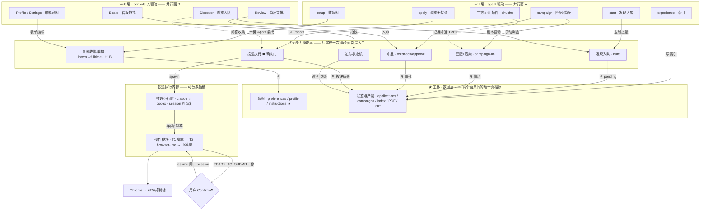
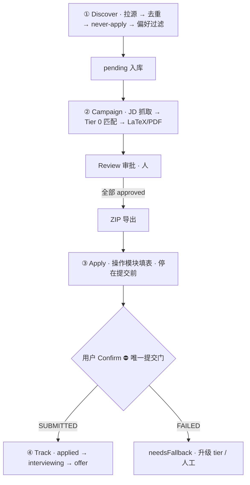
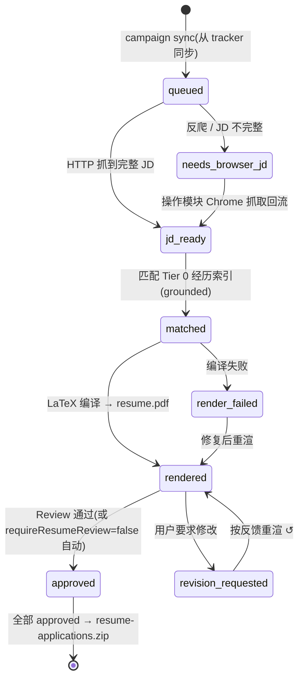
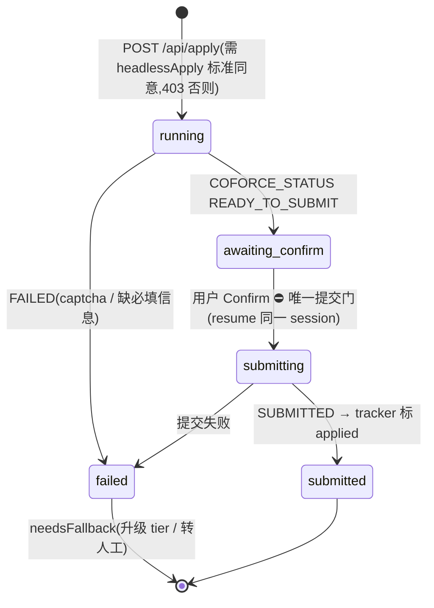

# CoForce Apply — 架构与流程

> 核心命题:**SKILL.md 编排层是产品本体**;推理运行时(claude ↔ codex)与
> 操作模块(脚本 / browser-use / 小模型)都是可替换插槽。
>
> 本文是架构的本地沉淀版,随代码增量维护(改架构 = 改这里的 mermaid,
> 不重画)。评审迭代历史(round 1–7)在
> [share server 系列](https://brand-studio.sma1lboy.me/s/coforce-arch)。

## 怎么读这份文档

- 想知道**系统长什么样** → [系统架构](#系统架构)(一张主图:数据基座 +
  双操作面 + 共享能力层 + 投递执行内部)。
- 想知道**一个 job 从发现到 offer 走过哪些步骤** → [端到端流程](#端到端流程)
  和它下面的命令对照表。
- 想知道**简历生产 / 投递各自的合法状态** → [两个状态机](#两个状态机)。
- 想改架构 → 先读[设计不变量](#设计不变量),它们是评审多轮收敛出来的
  结论,违反其一的改动需要先推翻对应论证。

## 系统架构

数据层是主体;上面**并行**两个操作面 —— skill 面(agent 驱动)和 web 面
(console,人驱动),彼此不分层级,都通过共享能力模块层读写数据层。
有的流程两面都能做(入队 job:start ↔ Discover;编辑意图:setup ↔
Profile/Settings);有的只在一面 —— 只在 web:看板拖拽、Review 审批、
偏好向导;只在 skill:JD 匹配与 LaTeX 渲染、浏览器投递、经历索引构建。
仅有的跨面动作是 web 的一键 Apply 按钮把活委托给 apply skill(经
board.mjs 起 agent),执行仍在 skill 面完成。

数据层的物理位置由统一规则解析(`.agents/lib/data-home.mjs`):
`$COFORCE_HOME` 覆盖 → checkout 内 `.coforce/`(private-fork 多端同步模式)
→ `~/.coforce`(默认本机)。

## 用户意图(preferences)的收集设计

意图**一次声明、处处生效**:setup 阶段 2 一批收齐,写入 canonical 的
`preferences.json`(带 `version`)—— 工作类型与方向、
needsSponsorship/workAuthorization、workMode、workDays、地点、薪资底线。
下游 hunt(H1B 选源过滤)、campaign(JD 匹配)、apply(筛选题作答,铁律:
绝不编造)统一读它。分工:

| 文件 | 角色 |
|---|---|
| `preferences.json` | canonical 用户意图 schema(唯一收集点:setup;console 的 Discover 向导 / Settings 只是编辑切片) |
| `apply-config.json` | 运行时配置与 consents(agent 选择、模板路径、headlessApply 等),不放意图 |
| `instructions.md` | 自由文本覆盖层,**优先级最高**;`## never-apply` 是结构化区块 + 自由散文共存的样板,hunt.mjs 机械解析 |

(历史:偏好曾散在 3 个文件、2 个收集点 —— Discover 首开才问工作类型、
work day 无字段。升格 preferences.json 后收敛为上表,评审 round 4 的
盘点表见 share 系列。)

## 端到端流程

全链路只有两处需要"浏览器之手"(JD 抓取兜底、最终投递)—— 其余全是
skill 层对数据面的纯本地计算,这是操作模块可以随意替换的结构性原因。

对照到实际使用(Claude Code 斜杠命令;Codex 为 `$` 前缀同名):

| 流程步骤 | 命令 / 入口 | 说明 |
|---|---|---|
| 一次性上线 | `/setup` | 数据家目录选择 → profile → 偏好 → 运行时/consents → verified 池 → 标准指令 |
| 建 bullet 池(Module 1) | `/experience <repo url>` + `/repo-bullets` | repo 证据 → JD-free bullets → 人审入 profile;非 repo 材料走 `/profile` Supplement 或 console「＋ Add with AI」 |
| ①→② 一轮循环 | `/start`(循环用 `/loop 30m /start` 或 Codex 定时任务) | 拉源→去重→过滤→JD→匹配→渲染,产物进 Review |
| 审批 | console Review tab(端口 4517) | 反馈重渲 ↺ 或 approve;全 approved 一键 ZIP |
| ③ 投递 | `/apply <url>` 或 console 一键 Apply | 填完一切、停在提交前;Confirm 后 resume 同一 session 提交 |
| ④ 追踪 | console Board 看板 | 拖拽即状态机迁移,档案在卡片详情 |

## 两个状态机

左:campaign 简历生产(只产出、不提交);右:apply 投递(**唯一提交门在
用户 Confirm**,两个运行时共用同一 `COFORCE_STATUS` 哨兵协议,契约全文
见 [docs/OPERATOR.md](OPERATOR.md))。

## 设计不变量

评审 7 轮收敛出的结论,改架构前先对照:

1. **数据文件是 skill 间唯一契约**。schema canonical 在 owning SKILL.md、
   带 version;skill 剧本对 schema 编程,绝不 import 另一个 skill 的代码
   (board.mjs 作为外围胶水例外)。
2. **操作模块是显式契约插槽**,不是散文约定:输入、`COFORCE_STATUS` 事件、
   确认门铁律、成本阶梯(T1 脚本 → T2 browser-use → 小模型)全部在
   [OPERATOR.md](OPERATOR.md);`needsFallback` 语义 = 升一档重试。
3. **运行时收敛在一个 adapter**(`tracker/scripts/agent-runner.mjs`):
   codex JSONL / claude 行日志 → 归一化事件,状态机只消费归一化事件;
   加第三个运行时 = 只写一个 adapter。
4. **唯一提交门是用户 Confirm**。任何模式(headless、auto-approve)都
   不得移除;`requireResumeReview: false` 只免简历审批,不免提交确认。
5. **两个操作面并行、不分层级**;新能力先落共享能力层,再决定暴露到
   哪个面。
6. **两模块简历管线**:Module 1 生成(JD-free、人审入池),Module 2 严格
   verbatim 选池(出池 id 结构性拒绝);改写必须回到 Module 1 的审核门。
7. **harness 是契约守卫**(`npm run harness`,CI 同款):决定性、无外网、
   双运行时覆盖 —— 动契约必须先让 harness 表达出来。

(当年评审提出的 6 项优化 —— 操作契约成文、数据契约版本化、adapter 收敛、
board.mjs 拆分 + P0 安全、CI、合后小修 —— 已全部落地;代码级 review 明细
见 share 系列 round 7 与 git history。)
