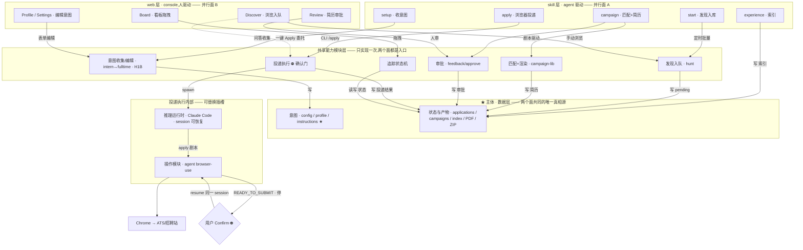
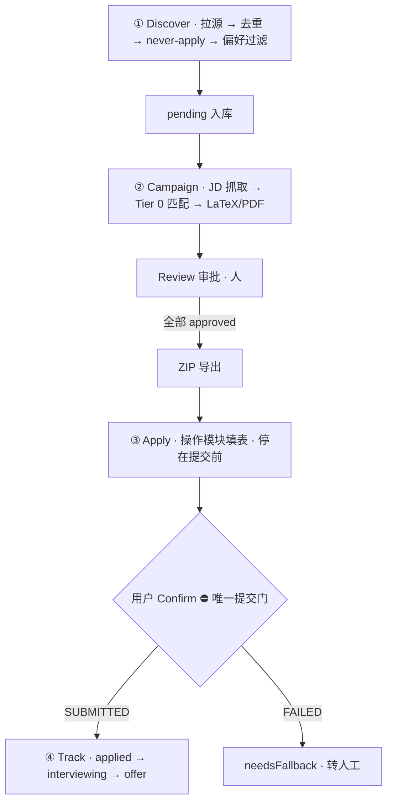
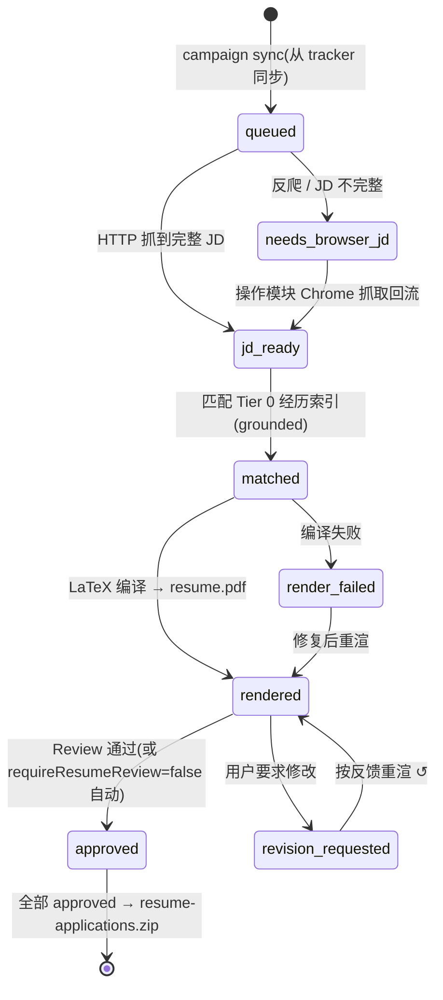
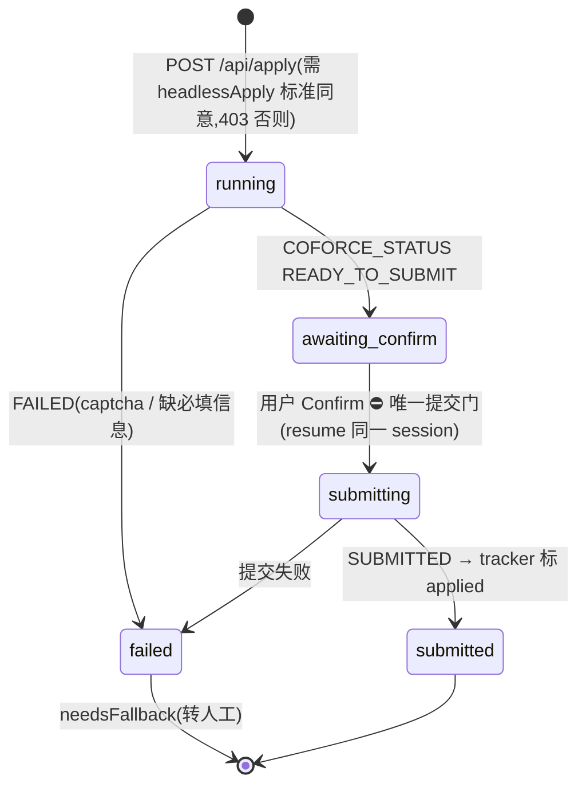

# CoForce Apply — 架构与流程

> 核心命题:**SKILL.md 编排层是产品本体**;推理运行时与操作模块都是插槽,
> 各自当前只有一个实现(Claude Code / agent browser-use)——插槽的价值在
> 于"换实现不动上层",不在于同时养多个实现。
>
> 本文是架构的本地沉淀版,随代码增量维护(改架构 = 改这里的 mermaid,
> 不重画)。评审迭代历史(round 1–7)在
> [share server 系列](https://brand-studio.sma1lboy.me/s/coforce-arch)。

## 怎么读这份文档

- 想知道**系统长什么样** → [系统架构](#系统架构)(一张主图:数据基座 +
  双操作面 + 共享能力层 + 投递执行内部)。
- 想知道**一个 job 从发现到 offer 走过哪些步骤** → [端到端流程](#端到端流程)
  和它下面的命令对照表。
- 想知道**简历生产 / 投递各自的合法状态** → [两个状态机](#两个状态机)。
- 想改架构 → 先读[设计不变量](#设计不变量),它们是评审多轮收敛出来的
  结论,违反其一的改动需要先推翻对应论证。

## 系统架构

数据层是主体;上面**并行**两个操作面 —— skill 面(agent 驱动)和 web 面
(console,人驱动),彼此不分层级,都通过共享能力模块层读写数据层。
有的流程两面都能做(入队 job:start ↔ Discover;编辑意图:setup ↔
Profile/Settings);有的只在一面 —— 只在 web:看板拖拽、Review 审批、
偏好向导;只在 skill:JD 匹配与 LaTeX 渲染、浏览器投递、经历索引构建。
仅有的跨面动作是 web 的一键 Apply 按钮把活委托给 apply skill(经
board.mjs 起 agent),执行仍在 skill 面完成。

```mermaid
flowchart TB
  subgraph SK[skill 层 · agent 驱动 —— 并行面 A]
    SETUP[setup · 收意图]
    EXP[experience · 索引]
    START[start · 发现入库]
    CAMP[campaign · 匹配+简历]
    APPLY[apply · 浏览器投递]
  end

  subgraph WEB[web 层 · console,人驱动 —— 并行面 B]
    DISC[Discover · 浏览入队]
    BOARD[Board · 看板拖拽]
    REV[Review · 简历审批]
    PSET[Profile / Settings · 编辑意图]
  end

  subgraph CAP[共享能力模块层 —— 只实现一次,两个面都是入口]
    C1[意图收集/编辑 · intern↔fulltime · H1B]
    C3[发现入队 · hunt]
    C4[匹配+渲染 · campaign-lib]
    C5[审批 · feedback/approve]
    C6[投递执行 ⛔ 确认门]
    C7[追踪状态机]
  end

  subgraph CORE[★ 主体 · 数据层 —— 两个面共同的唯一真相源]
    INTENT[意图 · config / profile / instructions ★]
    STATE[状态与产物 · applications / campaigns / index / PDF / ZIP]
  end

  SETUP -->|问答收集| C1
  PSET -->|表单编辑| C1
  START -->|定时批量| C3
  DISC -->|手动浏览| C3
  CAMP -->|剧本驱动| C4
  CAMP --> C5
  REV -->|人审| C5
  APPLY -->|CLI /apply| C6
  DISC -.->|一键 Apply 委托| C6
  BOARD -->|拖拽| C7
  EXP -->|写 索引| STATE
  subgraph EXEC[投递执行内部 —— 可替换插槽]
    RT[推理运行时 · Claude Code · session 可恢复]
    OP[操作模块 · agent browser-use]
  end
  CHATS[Chrome → ATS/招聘站]
  GATE{用户 Confirm ⛔}

  C6 -->|spawn| RT
  RT -->|apply 剧本| OP
  OP --> CHATS
  OP -->|READY_TO_SUBMIT · 停| GATE
  GATE -->|resume 同一 session| OP

  C1 -->|写| INTENT
  C3 -->|写 pending| STATE
  C4 -->|写 简历| STATE
  C5 -->|写 审批| STATE
  C6 -->|写 投递结果| STATE
  C7 -->|读写 状态| STATE
```

数据层的物理位置由统一规则解析(`.agents/lib/data-home.mjs`):
`$COFORCE_HOME` 覆盖 → checkout 内 `.coforce/`(private-fork 多端同步模式)
→ `~/.coforce`(默认本机)。

## 用户意图(preferences)的收集设计

意图**一次声明、处处生效**:setup 一批收齐,写入 `config.json`
(扁平一层,带 `version: 2`)—— 工作类型与方向、
needsSponsorship/workAuthorization、workMode、地点、薪资底线,以及运行时
配置与 consents(模板路径、headlessApply、autoRegister、job sources)。
下游 hunt(选源过滤)、campaign(JD 匹配)、apply(筛选题作答,铁律:
绝不编造)统一读它。分工:

| 文件 | 角色 |
|---|---|
| `config.json` | 用户设置的唯一文件:意图 + 运行时配置 + consents。唯一收集点是 setup;console 的 Discover 向导 / Settings 只是编辑切片,写入永远是 **merge 不是 replace**(见下) |
| `instructions.md` | 自由文本覆盖层,**优先级最高**;`## never-apply` 是结构化区块 + 自由散文共存的样板,`.agents/lib/never-apply.mjs` 机械解析 |

三条硬约束,改这块前先看:

1. **写入必须 merge**。console 的筛选点一下只发 `{level, directions}` 两个键;
   若写成 replace,一次「Reset filters」就抹掉用户的签证状态。`saveConfig`
   只做 merge,`check-config.mjs` 钉住这条。
2. **"没设置过"必须仍然可检测**。`loadConfig` 对一个从没 setup 过的数据家
   目录返回 `{}` 且**不写文件**;console 的欢迎向导靠 intent 切片为 null
   触发(判据是 `level` 未设,不是"文件不存在")。
3. **旧装机零操作迁移**。首次读到 legacy 的 `preferences.json` +
   `apply-config.json` 时就地合成 config.json,旧文件留在盘上不删;
   重叠键 preferences 胜(它本来就是 canonical 的那个)。

(历史:意图曾散在 3 个文件、2 个收集点;升格 `preferences.json` 收敛过一次,
但它与 `apply-config.json` 仍然重叠 —— `needsSponsorship` 两边都有、文档说
已迁移而真实数据没迁,`workDays` 收集了却零消费者。合并为 config.json 时
`workDays` 与 `agent` 一并删除。)

## 端到端流程

全链路只有两处需要"浏览器之手"(JD 抓取兜底、最终投递)—— 其余全是
skill 层对数据面的纯本地计算,这是操作模块可以随意替换的结构性原因。

```mermaid
flowchart TB
  A[① Discover · 拉源 → 去重 → never-apply → 偏好过滤] --> B[pending 入库]
  B --> C[② Campaign · JD 抓取 → Tier 0 匹配 → LaTeX/PDF]
  C --> D[Review 审批 · 人]
  D -->|全部 approved| E[ZIP 导出]
  E --> F[③ Apply · 操作模块填表 · 停在提交前]
  F --> G{用户 Confirm ⛔ 唯一提交门}
  G -->|SUBMITTED| H[④ Track · applied → interviewing → offer]
  G -->|FAILED| I[needsFallback · 转人工]
```

对照到实际使用(Claude Code 斜杠命令):

| 流程步骤 | 命令 / 入口 | 说明 |
|---|---|---|
| 一次性上线 | `/setup` | 数据家目录选择 → profile → 偏好 → 运行时/consents → verified 池 → 标准指令 |
| 建 bullet 池(Module 1) | `/experience <repo url>` | repo 证据 → JD-free bullets → 人审入 profile;非 repo 材料走 `/profile` Supplement 或 console「＋ Add with AI」 |
| ①→② 一轮循环 | `/start`(循环用 `/loop 30m /start`) | 拉源→去重→过滤→JD→匹配→渲染,产物进 Review |
| 审批 | console Review tab(端口 4517) | 反馈重渲 ↺ 或 approve;全 approved 一键 ZIP |
| ③ 投递 | `/apply <url>` 或 console 一键 Apply | 填完一切、停在提交前;Confirm 后 resume 同一 session 提交 |
| ④ 追踪 | console Board 看板 | 拖拽即状态机迁移,档案在卡片详情 |

## 两个状态机

左:campaign 简历生产(只产出、不提交);右:apply 投递(**唯一提交门在
用户 Confirm**,操作模块用 `COFORCE_STATUS` 哨兵协议汇报,契约全文
见 [docs/OPERATOR.md](OPERATOR.md))。

```mermaid
stateDiagram-v2
  [*] --> queued: campaign sync(从 tracker 同步)
  queued --> jd_ready: HTTP 抓到完整 JD
  queued --> needs_browser_jd: 反爬 / JD 不完整
  needs_browser_jd --> jd_ready: 操作模块 Chrome 抓取回流
  jd_ready --> matched: 匹配 Tier 0 经历索引(grounded)
  matched --> rendered: LaTeX 编译 → resume.pdf
  matched --> render_failed: 编译失败
  render_failed --> rendered: 修复后重渲
  rendered --> approved: Review 通过(或 requireResumeReview=false 自动)
  rendered --> revision_requested: 用户要求修改
  revision_requested --> rendered: 按反馈重渲 ↺
  approved --> [*]: 全部 approved → resume-applications.zip
```

```mermaid
stateDiagram-v2
  [*] --> running: POST /api/apply(需 headlessApply 标准同意,403 否则)
  running --> awaiting_confirm: COFORCE_STATUS READY_TO_SUBMIT
  running --> failed: FAILED(captcha / 缺必填信息)
  awaiting_confirm --> submitting: 用户 Confirm ⛔ 唯一提交门(resume 同一 session)
  submitting --> submitted: SUBMITTED → tracker 标 applied
  submitting --> failed: 提交失败
  failed --> [*]: needsFallback(转人工)
  submitted --> [*]
```

## 设计不变量

评审 7 轮收敛出的结论,改架构前先对照:

1. **数据文件是 skill 间唯一契约**。schema canonical 在 owning SKILL.md、
   带 version;skill 剧本对 schema 编程,绝不 import 另一个 skill 的代码
   (board.mjs 作为外围胶水例外)。
2. **操作模块是显式契约插槽**,不是散文约定:输入、`COFORCE_STATUS` 事件、
   确认门铁律全部在 [OPERATOR.md](OPERATOR.md)。当前只有一个操作模块
   (agent browser-use);`needsFallback` 语义 = 操作模块放弃、转人工。
   (曾经有个扩展脚本填表当免费 T1,已删:agent 能覆盖同样的页面,维护
   第二套实现比它省下的 LLM 调用更贵。想换回便宜实现,照 OPERATOR.md 接。)
3. **运行时收敛在一个 adapter**(`tracker/scripts/agent-runner.mjs`):
   CLI 输出 → 归一化 `COFORCE_STATUS` 事件,状态机只消费归一化事件、
   不含任何 per-runtime 分支。当前实现只有 Claude Code(codex 分支已删,
   见该文件的 `TODO(codex)`);加回一个运行时 = 只动 `agentRun`/`parseLine`。
4. **唯一提交门是用户 Confirm**。任何模式(headless、auto-approve)都
   不得移除;`requireResumeReview: false` 只免简历审批,不免提交确认。
5. **两个操作面并行、不分层级**;新能力先落共享能力层,再决定暴露到
   哪个面。
6. **两模块简历管线**:Module 1 生成(JD-free、人审入池),Module 2 严格
   verbatim 选池(出池 id 结构性拒绝);改写必须回到 Module 1 的审核门。
7. **harness 是契约守卫**(`npm run harness`,CI 同款):决定性、无外网、
   覆盖投递生命周期 —— 动契约必须先让 harness 表达出来。

(当年评审提出的 6 项优化 —— 操作契约成文、数据契约版本化、adapter 收敛、
board.mjs 拆分 + P0 安全、CI、合后小修 —— 已全部落地;代码级 review 明细
见 share 系列 round 7 与 git history。)
