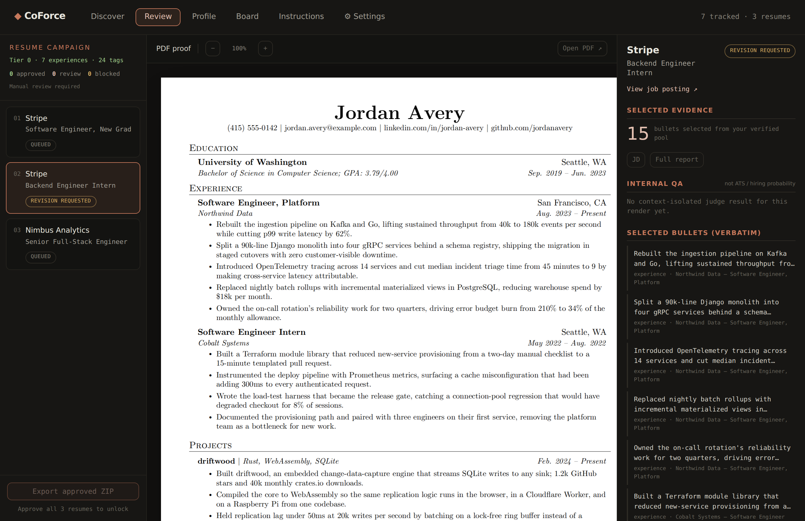
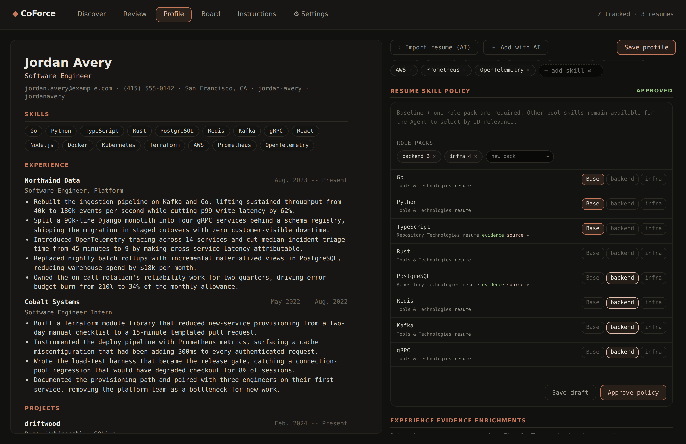
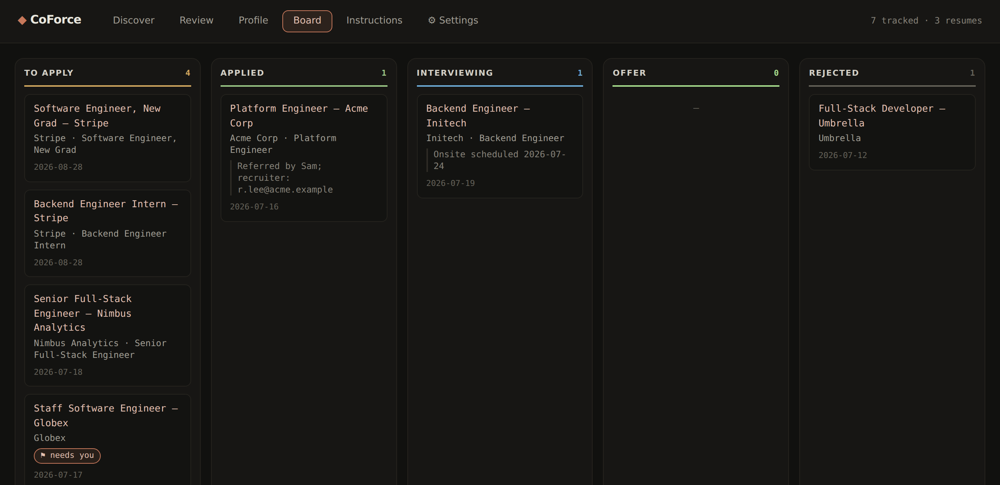

# Using CoForce Apply

Installation is in [INSTALL.md](INSTALL.md). This is what to type once it runs,
what each command actually does, and what to do when something stalls.

- [Vocabulary](#vocabulary) — five words the rest of this doc assumes
- [A worked run, start to finish](#a-worked-run-start-to-finish)
- [Command reference](#command-reference)
- [The console](#the-console)
- [Scripts you can run directly](#scripts-you-can-run-directly)
- [Troubleshooting](#troubleshooting)
- [FAQ](#faq)

---

## Vocabulary

**Verified pool.** Every bullet in `profile.json` that you have reviewed. A
tailored resume may only *select* from this pool, verbatim — it can never write
a new line about you. Rewording goes back through review first.

**Module 1 / Module 2.** Module 1 (supply) turns your real work into reviewed
bullets, with no job description in sight. Module 2 (demand) reads one job
description and selects from what Module 1 produced. The split is why the tool
cannot invent experience to fit a posting.

**Tier 0 index.** A compact, local, tagged index built from your profile plus
cached GitHub evidence. Job matching reads this index; it does not re-scan
GitHub for every job.

**Campaign.** One batch of jobs being turned into resumes: JD hydration →
selection → render → machine gates → your review → approve → ZIP.

**Operator.** The one component that actually submits an application — the
`apply` skill, driving your visible Chrome. Its contract is in
[OPERATOR.md](OPERATOR.md).

---

## A worked run, start to finish

### 0. The two-minute version (no onboarding)

```
/tailor https://job-posting-url
```

`/tailor` asks two questions if it has nothing to work with — point it at your
existing resume (a PDF path or pasted text) and it imports the profile itself.
Out comes a one-page PDF at `~/.coforce/out/resume-<company>-<role>.pdf`.
Nothing below is required to get that.

### 1. `/setup` — once

Onboarding runs in stages and skips any stage that is already done: data home
(local or private-fork), profile (interview or import), intent and consents,
the LaTeX template, verified bullets, and your standing instructions. Every
stage asks its questions in one batch and waits for you.

What it writes: `profile.json`, `config.json`, `templates/resume_template.tex`,
`instructions.md`. See [DATA.md](DATA.md) for what each file is.

`~/.coforce/instructions.md` is the file with the most authority in the system.
Its `## never-apply` list is checked by every skill and every script, before
anything else happens.

### 2. `/experience` — teach it what you actually built

```
/experience https://github.com/you/your-repo     # or a PR or commit URL
/experience refresh                              # fetch + rebuild (the only GitHub call)
/experience build                                # rebuild offline after profile edits
/experience status                               # is the index current?
```

Paste a repository, PR, or commit URL. The agent infers the repo and whose work
counts, and asks you to confirm only if the inference looks wrong. `refresh`
then fetches just those authors' history and writes the Tier 0 index.

The same skill turns a repo's real commits into JD-free STAR bullets. You
approve them one by one; approval is what puts them in the verified pool with
`source` and `verifiedAt` provenance.

### 3. `/start` — one cycle

Fetch your job sources → hydrate full job descriptions → match against the local
Tier 0 index → render PDFs → open the Review workspace. Already-approved jobs
are left alone, and feedback you saved last round is applied this round.

```
/loop 30m /start     # the same cycle, repeatedly
```

### 4. Review and approve

Open `http://localhost:4517` and work the **Review** tab: the PDF proof next to
the job link, the evidence that was selected, and the internal QA panel. Approve,
or write feedback and request a revision. When every job is approved, export them
all as one ZIP.

If you would rather not review each one, turn off **Require resume review** in
Settings: complete one-page PDFs auto-approve and the ZIP refreshes itself.
Submission is still gated either way.

### 5. `/apply <url>` — submit

```
/apply https://job-posting-url
```

`/apply` initialises Claude in Chrome and drives the same visible, logged-in
browser you already use: fills the form, registers an ATS account if you
consented, drafts the free-text answers and shows them to you first — and stops
before the final submit, every time, in every mode. The last click is yours.

Outcomes land in the tracker, and the per-application archive is at
`~/.coforce/applications/<id>/`.

---

## Command reference

| Command | What it does |
|---|---|
| `/coforce` | Router. Say what you want in any words ("我想找工作", "what next") and it picks the skill, or routes by pipeline state when the intent is vague. |
| `/setup` | One-time onboarding. Re-run it any time to change preferences; completed stages are skipped. |
| `/profile` | Maintain your background: init, update, **supplement** (hand it a story, URL, or PDF and it drafts schema-shaped entries for approval), and gap review. |
| `/experience <url>` | Add a GitHub repo / PR / commit as an evidence source. |
| `/experience refresh` | Fetch the declared authors' history and rebuild the Tier 0 index. The only command that touches GitHub. |
| `/experience build` | Rebuild the index offline, after profile-only edits. |
| `/experience status` | Report whether the index is current, stale, or missing. |
| `/start` | One discover → match → render → review cycle. |
| `/campaign` | The batch resume workflow itself: sync, hydrate, select, render, judge, feedback, approve, export. |
| `/tailor <jd>` | One job description → one tailored one-page resume (`pdf`, `tex`, or `docx`). |
| `/apply <url>` | Fill and submit one application, stopping before the final submit. |
| `/tracker` | Application statuses, the kanban board, and the per-application archive. |

---

## The console

`http://localhost:4517`, served by the tracker skill (`npm run board` from a
checkout, or `.agents/skills/tracker/scripts/start_web.sh`). It is a local
workspace over `~/.coforce/` — nothing is uploaded anywhere. It follows your
system light/dark preference.


**Discover** — postings pulled from your configured GitHub job lists
(speedyapply, vanshb03, jobright-ai out of the box), classified by level and
direction, filterable, with one-click **Build resume →**. Never-apply companies
and already-tracked jobs are filtered out server-side — the counter line tells
you exactly how many were dropped for each reason. Below the list, **N screened
out** expands into everything `/start` ruled out for fit, each with its reason;
**Reconsider** puts one back in circulation. The filter is a suggestion, not a
gate — you always get to apply to a job it did not want.


**Review** — the resume workspace: a zoomable PDF proof in the middle, the job
and its selected evidence on the right, the campaign's jobs and the export gate
on the left.



Every bullet in the right rail is shown verbatim with the profile entry it came
from — the panel exists so you can check that nothing was invented. **Internal
QA** reports the machine gates (one page, page filled, text extractable) and the
LLM judge's verdict; it is explicitly *not* an ATS score or a hiring
probability. Approve, or leave a note and request a revision.

**Profile** — your record as a live resume preview on the left, an editable form
on the right, including the **resume skill policy**: which skills are mandatory
baseline, which belong to a named role pack, and which stay available for the
agent to pick by JD relevance.



A campaign refuses to select skills until you have approved that policy — a
non-empty baseline and at least one non-empty role pack. **Import resume (AI)**
and **＋ Add with AI** both parse pasted text into draft entries; nothing is
written to disk until you press *Save profile*.

**Board** — five columns, To Apply → Applied → Interviewing → Offer / Rejected.
Drag a card to change its status; open one for the JD link, notes, the delivery
timeline, and archived files. A card marked **⚑ needs you** is one the operator
could not finish alone. Every card here is an application you are actually
chasing, and **Rejected means a company said no** — postings ruled out for fit
never reach the board at all; they go to `~/.coforce/screened.json` with the
reason, so the counts you read are real ones.



**Instructions** — edits `~/.coforce/instructions.md` directly.

**Settings** — discovery filters; the LaTeX template path, CJK font, and minimum
page coverage; **Require resume review**; the apply consents (one-click
background apply, ATS auto-registration, account email, resume PDF,
verification-code method); and the job source list.

> [!NOTE]
> The console's AI buttons and its background apply flow start Claude Code
> subprocesses on your machine, with permission prompts disabled for that run
> (that is what makes an unattended background apply possible). The confirmation
> gate before a final submit is enforced separately and is not skipped.

---

## Scripts you can run directly

Skills own their scripts; you rarely need these, but they are the same code the
skills call, and they are useful for debugging.

```sh
# discovery
node .agents/skills/start/scripts/hunt.mjs [--track] [--apps <path>] [--instructions <path>]
node .agents/skills/start/scripts/hunt.mjs screen <url> --reason "<why>"   # seen, not for me
node .agents/skills/start/scripts/hunt.mjs unscreen <url>                  # let it come back

# evidence
node .agents/skills/experience/scripts/experience.mjs source add <url> [--author <login>] [--project <name>]
node .agents/skills/experience/scripts/experience.mjs source list | remove <url>
node .agents/skills/experience/scripts/experience.mjs refresh | build | status | skills

# campaign
node .agents/skills/campaign/scripts/campaign.mjs sync | pool | skills | skill-review | show
node .agents/skills/campaign/scripts/campaign.mjs hydrate --id <id> [--file <path> | --text <str>]
node .agents/skills/campaign/scripts/campaign.mjs select --id <id> --bullets <ids> [--skills <ids>] [--skill-pack <name>] [--language en-US|zh-CN]
node .agents/skills/campaign/scripts/campaign.mjs assemble | render | judge --id <id>
node .agents/skills/campaign/scripts/campaign.mjs feedback --id <id> --text <str>
node .agents/skills/campaign/scripts/campaign.mjs approve --id <id>
node .agents/skills/campaign/scripts/campaign.mjs export [--out <path>]
node .agents/skills/campaign/scripts/campaign.mjs outcomes    # which bullets rode on resumes that advanced

# console
node .agents/skills/tracker/scripts/board.mjs [applications.json] --serve [port]
```

All of them take `--data-dir <path>` to run against a sandbox instead of your
real data home.

---

## Troubleshooting

**"selection includes bullets outside the verified pool"**
Bullet ids are content hashes of the bullet text. If `description[].text` in
`profile.json` was reformatted, re-wrapped, or trimmed — even by one character —
every already-matched job loses that bullet. Restore the exact text, or re-run
the match. Never bulk-reformat profile bullet text.

**"skill policy is review_requested"**
Open the console's Profile tab and approve the resume skill policy: a non-empty
baseline plus at least one non-empty role pack. Campaign selection deliberately
refuses to guess this for you.

**A resume renders but stays unapprovable**
Missing `pdfinfo` / `pdftotext`. See [INSTALL.md](INSTALL.md#install-troubleshooting).

**`/apply` stalls on a form**
The operator reports a blocker instead of looping after it gets stuck twice on
the same widget, and the application is flagged **⚑ needs you** on the board.
Finish that one by hand; nothing is submitted in the meantime.

**The one-page check fails**
The template targets a full page with content reaching ≥93% down it. Fewer
bullets, or a lower minimum page coverage in Settings, are both valid answers.

**Job sources return nothing new**
Everything they list is already tracked, already screened out, or was filtered
by your never-apply list. `hunt.mjs` prints exactly that breakdown:
`{new, skipped:{tracked, screened, blocked}, sources}`.

**A job I wanted disappeared from Discover**
It was ruled out for fit — wrong level, no sponsorship, onsite when you asked
for remote. Open **N screened out** at the bottom of Discover to see it with
its reason and press **Reconsider**; `hunt.mjs unscreen <url>` does the same
from a shell. Either way it is back on the next refresh.

---

## FAQ

**Do I need to know LaTeX?**
No. A template ships with the tool and `/setup` installs it for you. Supply your
own `.tex` only if you want your own design.

**Does it work on Linux?**
Yes, apart from ATS account password storage, which uses the macOS Keychain, and
the `textutil` fallback for `.docx`. Windows needs WSL2.

**Will it ever submit something without me?**
No. The final submit is a hard stop in every mode, including the console's
background apply — which prints `READY_TO_SUBMIT` and waits for you to click
Confirm. Turning off resume review auto-approves *PDFs*, never submissions.

**Can it write experience I do not have?**
Structurally, no. Module 2 selects bullet ids out of the pool you reviewed; an
id that is not in the pool is rejected before anything is rendered. New wording
has to go back through Module 1's review gate.

**What does it read on GitHub?**
Only the repositories you explicitly added as sources, and only the history of
the authors declared for them, through your authenticated `gh`. Nothing is
scanned implicitly, and it happens only when you run `/experience refresh`.

**I already have a resume — do I have to retype it?**
No. `/setup`, `/profile`, `/tailor`, and the console's *Import resume (AI)* all
take an existing PDF or pasted text.

**Where does my data go?**
`~/.coforce/` on your machine, and nowhere else. See [DATA.md](DATA.md) and
[PRIVACY.md](../PRIVACY.md).

**How do I change my preferences later?**
Re-run `/setup` (completed stages are skipped) or edit them in the console's
Settings tab.

**Where do I report a bug?**
[github.com/Sma1lboy/coforce-apply/issues](https://github.com/Sma1lboy/coforce-apply/issues).
